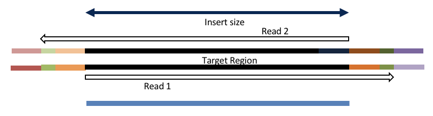

# hts_Overlapper: Overlapping and Adapter Trimming of Paired end reads

The hts_Overlapper application attempts to overlap paired end reads to reproduce the original fragment, trims adapters when present, and in some cases, correct sequencing errors.
hts_Overlapper is one of the few applications that can create single end (overlapped)
reads from paired end input.

Single end reads are ignored by hts_Overlapper and output unaltered.

## Usage

```bash
hts_Overlapper --help
```

## Command Line Parameters

[Common Parameters Plus](common_parameters)

<br>
**Application Specific Options:**

| Parameter | Description | Default |
| :--- |  :--- | :--- |
|   -p [ --number-of-threads ]  |    Number of worker threads (min 1, max 8) | 1 |
|   -c [ --check-lengths ] |       Check lengths of the ends (min 5, max 10000) | 20 |
|   -k [ --kmer ]   |                   Kmer size of the lookup table for the | 8 |
|                      |                   longer read (min 5, max 64) | |
|   -r [ --kmer-offset ] |          Offset of kmers. Offset of 1, would be |    1   |
|                        |                  perfect overlapping kmers. An offset of | |
|                        |                  kmer would be non-overlapping kmers | |
|                        |                  that are right next to each other. Must | |
|                        |                  be greater than 0. | |
|   -e [ --max-mismatch-errorDensity ] | Max percent of mismatches allowed in | 0.25 |
|                        |                 overlapped section (min 0.0, max 1.0) | |
|   -x [ --max-mismatch ] |     Max number of total mismatches allowed | 100 |
|                          |               in overlapped section (min 0, max 10000) | |
|   -o [ --min-overlap ] |         Min overlap required to merge two reads | 8 |
|                         |                (min 5, max 10000) | |
|   -X [ --force-pairs ]    |              after overlapping a paired end read, | |
|                           |              split reads in half to output pairs. | |


## JSON Output

```
{
"Program_details": {
    "program": "hts_Overlapper",
    "version": version used,
    "options": {
        Key:value pair list of options provided on the command line
    }
},
"Fragment": {
    "in": numeric value of total fragments input,
    "out": numeric value of total fragment output,
    "basepairs_in": numeric value of total basepairs input,
    "basepairs_out": numeric value of total basepairs output,
    "inserts": {
        "short": overlapped reads shorter than the read length,
        "medium": overlapped reads > read length and less than 2x read length,
        "long": non-overlapping reads
    },
    "overlap_histogram": [ two column matrix, overlap length by counts ]    
},
"Single_end": {
    "in": numeric value of total single-end reads input,
    "out": numeric value of total single-end reads output,
    "basepairs_in": numeric value of total single-end basepairs input,
    "basepairs_out": numeric value of total single-end basepairs output,
},
"Paired_end": {
    "in": numeric value of total paried-end reads input,
    "out": numeric value of total paired-end reads output,
    "Read1": {
        "total_basepairs": numeric value of total read 1 basepairs input,
        "total_Q30_basepairs": numeric value of total read 1 basepairs input,
    },
    "Read2": {
        "total_basepairs": numeric value of total read 2 basepairs input,
        "total_Q30_basepairs": numeric value of total read 2 basepairs input,
    }
}
}
```

## Algorithm

HTS_Overlapper uses matching kmers, defined by `kmer` and `kmer-offset`, within
`check-lengths` basepairs of the ends of the shorter read to initiate overlap
testing. If read pairs overlap, either the 5' or 3' end of the shorter read
must be contained within the longer read this test prevents needless
computationally expensive ovelaps from being evaluated.

Once a kmer match has been found, the reads are checked for overlap, up to
`--max-mismatch-errorDensity` or `--max-mismatch`. Reads must overlap by at
least `--min-overlap` basepairs at the ends of the reads to be considered a valid
overlap. When reads completely overlap each other (produced overlapped length < length of
the shorter read), by definition, overhanging sequences occur prior to the 5' ends
of the reads (most frequently adapter sequences) and are trimmed off.

On a basepair match: the overlapped basepair is unambiguous and is assigned the longer
read base, quality scores of the two reads are added together (max=40) to produce the
new score. On a basepair mismatch: the overlapped basepair is assigned the higher
quality base from the two reads and the quality score of the lower quality read is subtracted from the higher quality score (min=0) to produce the new score.

The `--force-pairs` options prevents production of single-end reads produced by
an overlap, by spliting the read down the middle, assiging the first hald to
read 1 and the second half to read 2.

## Comments

Reads come in three flavors:

### short
Reads produced from an insert shorter than the longest read
will result in a single read in the orientation of R1, and have overhanging
bases (adapters) trimmed to produce a SE read.

**Insert size < length of the read length**



product: adapter trimmed, single

### medium
Reads produced from a medium-insert greater than read length, but shorter
than 2x read length, or the number of cycles (by at least min overlap) will
produce a SE read in the orientation of R1.

**Insert size < length of the number of cycles**


product: extended, single

### long

Reads produced from long-inserts which do not overlap by at least min overlap , resulting in a PE read.

**Insert size > length of the number of cycles**


product: original pairs
