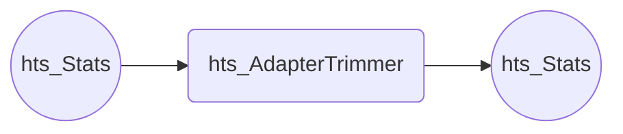

# Building Custom Workflows

HTStream suite of applications is designed to be modular, perform a singular operation on a read, and be interoperable with each other. Workflows can be designed to the specific sequencing library, performing the applications in an order and with parameters that make sense for the experiment.


Each applications can be described one of three different types.

#### Applications that don't modify the sequence in any way.


#### Applications that discard reads based on some criteria.


#### Applications that trims basepairs from reads based on some criteria.


#### Applications that can produce single-end reads from paired-end reads.

Note: hts_Overlapper is also an application that trims basepairs from reads.
{:.info}
Note: hts_LengthFilter is also an application that discards reads.
{:.info}

## A simple workflow to trim adapters from paired-end reads.



```bash
hts_Stats -L sample1.json -N "initial Stats" \
    -1 sample1_S1_L001_R1_001.fastq.gz \  
    -2 sample1_S1_L001_R1_001.fastq.gz | \  
hts_AdapterTrimmer -A sample1.json -N "trim adapters" | \  
hts_Stats -A sample1.json -N "final Stats" \  
    -f sample1_preprocessed  
```

This pipeline first runs hts_Stats to record the original read quality statistics, then trims adapters, and finally runs hts_Stats again to record the final read quality statistics. The input files are only read in once in the first application and the prefix to the preprocessed sequence is sample1_preprocessed. All of the stats from each application are in sample1.json for review.

But remember hts_AdapterTrimmer only perform basepair trimming (trims adapters) and could produce very short, near 0 length reads. To add a read length filter of 50bp to our workflow.
{:.warning}

```mermaid
graph LR
    hts_Stats1((hts_Stats)) --> hts_AdapterTrimmer(hts_AdapterTrimmer) --> hts_LengthFilter[/hts_LengthFilter/] --> hts_Stats2((hts_Stats))

classDef cssSingles fill:#2c3e50,stroke:#3498db;
class hts_LengthFilter cssSingles;

click hts_Stats1 "../applications/hts_Stats.html" "hts_Stats documentation page."
click hts_Stats2 "../applications/hts_Stats.html" "hts_Stats documentation page."
click hts_AdapterTrimmer "../applications/hts_AdapterTrimmer.html" "hts_AdapterTrimmer documentation page."
click hts_LengthFilter "../applications/hts_LengthFilter.html" "hts_LengthFilter documentation page."
```



```bash
hts_Stats -L sample1.json -N "initial Stats" \
    -1 sample1_S1_L001_R1_001.fastq.gz \  
    -2 sample1_S1_L001_R1_001.fastq.gz | \  
hts_AdapterTrimmer -A sample1.json -N "trim adapters" | \  
hts_LengthFilter -A sample1.json -N "remove reads < 50bp" \  
    -m 50 | \  
hts_Stats -A sample1.json -N "final Stats" \  
    -f sample1_preprocessed  
```
