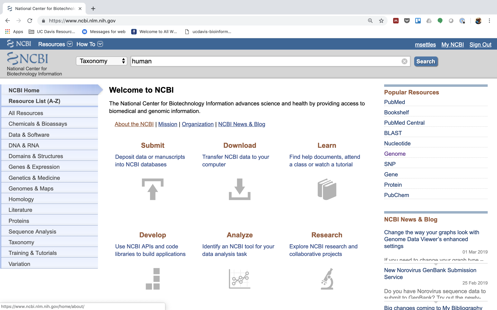
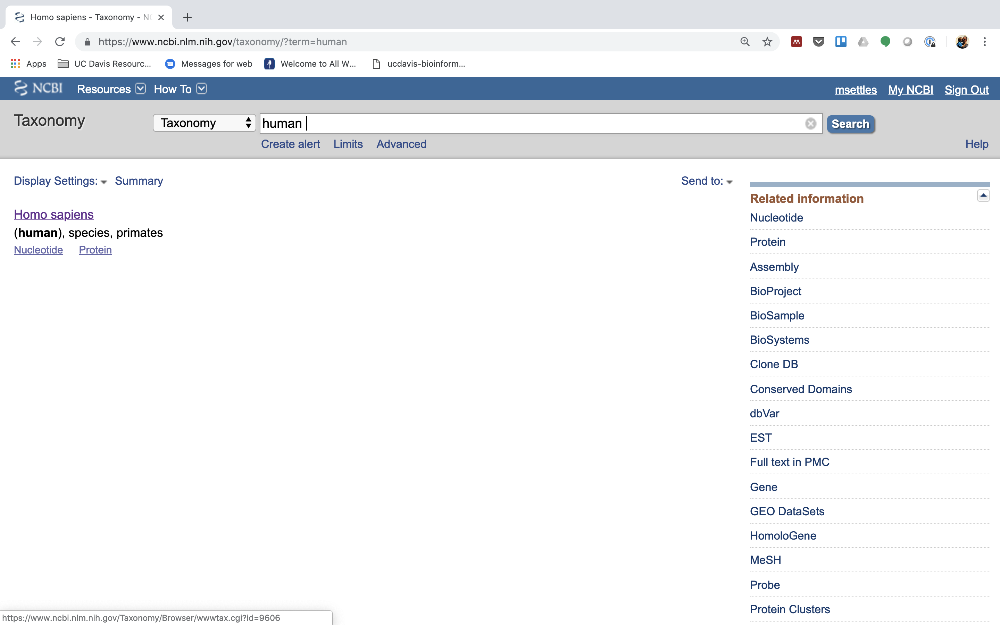
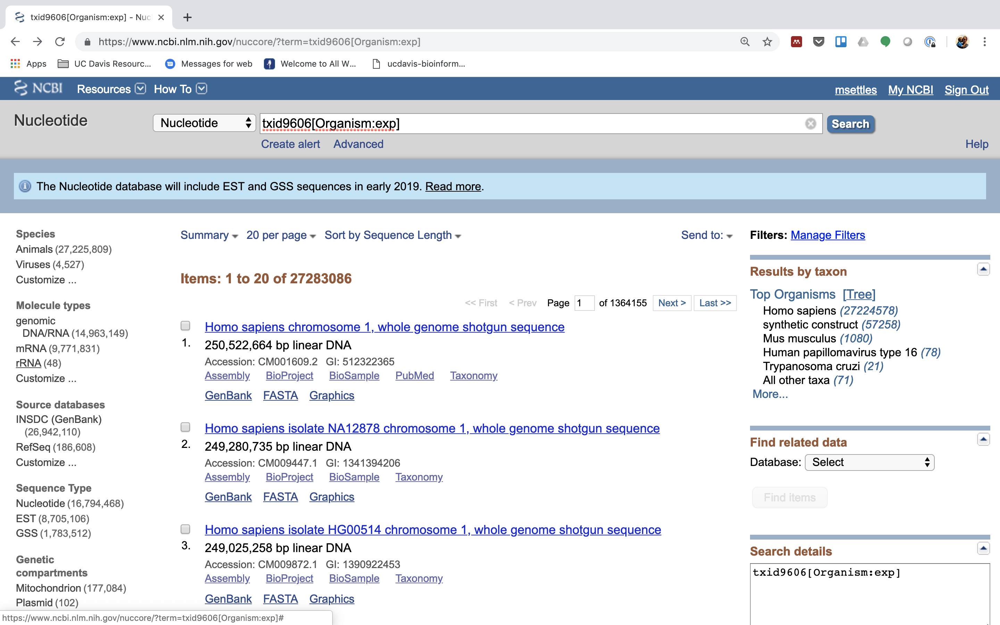

# A HTStream Workflow To Process mRNA libraries

A HTStream workflow for processing "standard" mRNA libraries.
This assumes some form of either mRNA enrichment, or rRNA depletion has occurred,
that transcripts have been randomly fragmented and that polyA(T) tails are expected
to be on either the 5' or 3' prime end of a fragment and can either be a polyA or polyT (so non-stranded libraries).

### Workflow Diagram


### Workflow Script
```bash
hts_Stats -L sample1_rna.json -N "initial stats" \  
    -1 sample1_S1_L001_R1_001.fastq.gz \  
    -2 sample1_S1_L001_R1_001.fastq.gz | \  
hts_SeqScreener -A sample1_rna.json -N "screen phix" | \
hts_SeqScreener -A sample1_rna.json -N "count the number of rRNA reads"\
     -r -s human_rrna.fasta | \
hts_SuperDeduper -A sample1_rna.json -N "remove PCR duplicates" | \
hts_AdapterTrimmer -A sample1_rna.json -N "trim adapters" | \
hts_PolyATTrim  -A sample1_rna.json -N "trim adapters" | \
hts_NTrimmer -A sample1_rna.json -N "remove any remaining 'N' characters" | \
hts_QWindowTrim -A sample1_rna.json -N "quality trim the ends of reads" | \
hts_LengthFilter -A sample1_rna.json -N "remove reads < 50bp" \  
    -n -m 50 | \
hts_Stats -A sample1_rna.json -N "final stats" \  
    -f sample1_preprocessed
```

### Workflow Description

As with all our workflows, we run hts_Stats both as the first application and the last application to generate full library stats pre and post processing. After hts_Stats, hts_SeqScreener is run using the default screen of PhiX (better safe to just check and remove), we then run hts_SeqScreener again, this time using a multi-fasta file with ribosomal RNA sequences (see '[Counting the number of rRNA reads in a sample](#counting-the-number-of-rrna-reads-in-a-sample)')and the option '-r' to count but not remove any reads that match the screening file. Next hts_SuperDeduper is run to remove PCR duplicates. So far each application run in the workflow so far removes entire reads and does not perform  any trimming. The next series of applications then trims reads, first hts_AdapterTrimmer (default adapter is TruSeq) to remove adapter sequences, hts_PolyATTrim to remove polyA(T) tails, hts_NTrimmer and hts_QWindowTrim to remove any 'N' bases and low quality respectively. Finally, we run hts_LengthFilter to remove any reads shorter than 50bp (-m 50) and produce no_orphan reads (-n), meaning any R1, or R2, discarded will discard both reads in the pair. The resulting fastq files will be exclusively paired-end reads remaining.

## Counting the number of rRNA reads in a sample

Ribosomal RNA can make up 90% or more of a typical _total RNA_ sample. Most library prep methods attempt to reduce the rRNA representation in a sample, oligoDt binds to polyA tails to enrich a sample for mRNA, where Ribo-depletion binds rRNA sequences to deplete the sample of rRNA. Neither technique is 100% efficient and so knowing the relative proportion of rRNA in each sample can be helpful.

In HTStream, you can screen (count only) for rRNA in a sample to determine rRNA efficiency. Before we do so we need to find sequences of ribosomal RNA to screen against. For example, a human rRNA screening database can be generated using the following steps:

*1.) First, go to NCBI and in the Search dropdown select "Taxonomy" and search for "human".*



*2.) Click on "Homo sapiens".*



*3.) Click on "Homo sapiens" again.*


*4.) Click on the "Subtree links" for Nucleotide*


*5.) Under Molecule Types, click on "rRNA" (left hand side).*



*6.) Click on "Send", choose "File", choose Format "FASTA", and click on "Create File".*


Save this file to your computer, and rename it to 'human_rrna.fasta'.
